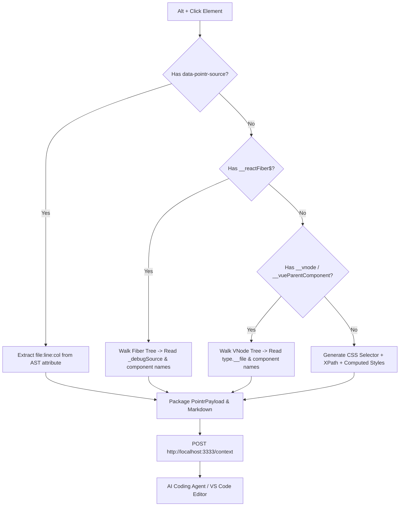

# Pointr Standalone Chrome Extension (`apps/chrome-extension`)

> **Visual Context Inspector for AI Coding Agents** — Inspect any local web app with `Alt + Click` and stream DOM, styles, and framework source metadata directly to your AI agents and editors without installing build plugins.

---

## 🌟 Overview

The **Pointr Standalone Chrome Extension** brings the full power of Pointr 2.0 to **any local development web application** (`http://localhost:*`, `http://127.0.0.1:*`, `http://0.0.0.0:*`) with zero build configuration:

- 🚀 **Zero Plugin Requirement**: Works on Next.js, Create React App, Webpack, Vite, Nuxt, Vue CLI, or plain HTML without modifying `vite.config.ts` or `package.json`.
- ⚛️ **Runtime React Fiber Resolution**: Traverses `__reactFiber$` and reads `_debugSource` / `_debugOwner` to extract the exact source file path (`src/components/Header.tsx:42:5`) and component tree at runtime.
- 🟢 **Vue 3 VNode Inspection**: Traverses `__vnode` and `__vueParentComponent` to locate SFC file paths (`src/views/Dashboard.vue`).
- 🎯 **Visual Reticle & Intent HUD**: Hold `Alt` and hover over any UI element to see instant source tooltips. `Alt + Click` pops up the intent dialog to type instructions for your AI agent.
- ⚡ **Local MCP Server Bridge**: Directly dispatches structured `PointrPayload` JSON to the local Pointr MCP Server on port `3333` (or `3334-3340`).
- 🔒 **Zero Telemetry & 100% Local**: No external analytics, no cloud endpoints. Everything stays strictly on your local machine.

---

## 📦 Installation (Load Unpacked)

The extension is built with **Manifest V3** and runs directly unpacked without requiring complicated build steps.

### In Google Chrome / Brave / Chromium:

1. Open your browser and navigate to:
   ```text
   chrome://extensions
   ```
2. Enable **Developer mode** in the top-right toggle.
3. Click the **Load unpacked** button in the top-left toolbar.
4. Select the directory:
   ```text
   /Users/hugobefort/dev/antigravity-projects/pointr/apps/chrome-extension
   ```
5. Pin the **Pointr** extension icon ⊕ to your browser toolbar.

### In Microsoft Edge:

1. Navigate to `edge://extensions`.
2. Turn on **Developer mode** in the left sidebar.
3. Click **Load unpacked** and select `apps/chrome-extension/`.

---

## 🕹️ Usage Workflow

### 1. Start the Pointr MCP Server

In your terminal, start the Pointr MCP server:

```bash
# In the pointr monorepo root:
pnpm dev

# Or directly with npx:
npx @pointr/mcp-server
```

The MCP server will listen on `http://127.0.0.1:3333`.

### 2. Open Your Local Dev App

Open any local project running in your browser, for example:

- `http://localhost:5173` (Vite)
- `http://localhost:3000` (Next.js / Create React App)
- `http://localhost:8080` (Vue / Webpack)

The Pointr extension icon will automatically light up with a green **ON** badge.

### 3. Inspect & Capture

1. **Hold `Alt`** and move your mouse over any element on the page.
2. An electric-cyan targeting reticle and HUD tooltip will highlight the component and display resolved source paths.
3. **`Alt + Click`** on the element you want to edit.
4. Enter your intent in the dialog (e.g., _"Make this button rounded with cyan gradient and add a hover scale effect"_).
5. Press **`Enter`** (or click _Send to Agent_).
6. Pointr immediately packages the element DOM, CSS classes, computed styles, and component hierarchy, sending it to the MCP Server!

---

## 🛠️ Architecture & File Structure

```
apps/chrome-extension/
├── manifest.json                # Chrome Manifest V3 declaration
├── package.json                 # Package & test scripts
├── background/
│   └── service-worker.js        # Tab monitoring, badge status, & MCP health check
├── content/
│   └── overlay-injector.js      # Reticle overlay, React Fiber/Vue traversal, & MCP dispatch
├── popup/
│   ├── index.html               # Sleek dark tech-brutalist popup UI
│   ├── popup.css                # Custom cyberpunk/slate styling
│   └── popup.js                 # Status manager & clipboard snippet viewer
├── icons/
│   ├── icon-16.png              # 16x16 crisp brand icon
│   ├── icon-48.png              # 48x48 brand icon
│   ├── icon-128.png             # 128x128 brand icon
│   └── icon.svg                 # Vector source icon
├── scripts/
│   └── generate-icons.js        # Pixel-perfect PNG generator
└── README.md                    # Documentation & setup guide
```

---

## 🔍 How Runtime Component Resolution Works

When `@pointr/vite-plugin` is present, Pointr uses `data-pointr-source` attributes.
When no plugin is installed, the Chrome Extension uses runtime reflection:



---

## 🧪 Testing

Run extension tests using Vitest:

```bash
pnpm --filter @pointr/chrome-extension test
```
