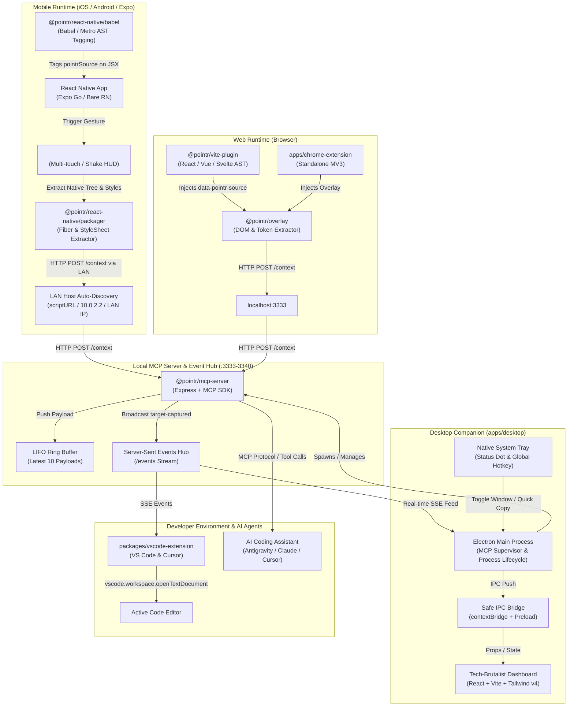
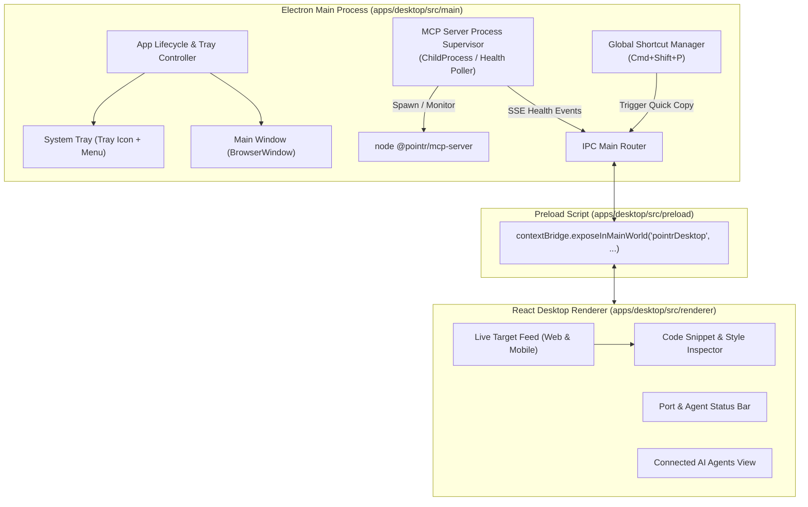
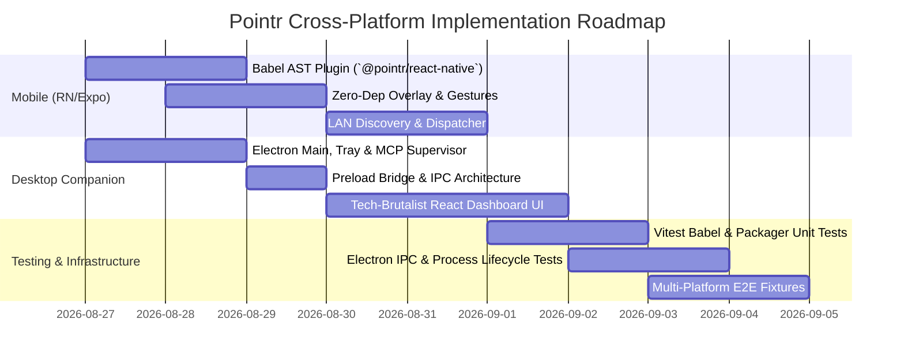

# Pointr Cross-Platform Expansion: Technical Roadmap & Architecture Plan

> **Author**: `project-planner`  
> **Status**: Ready for Implementation  
> **Target Version**: Pointr 2.5 (Cross-Platform Edition)  
> **Ecosystem Scope**: React Native & Expo (`packages/react-native`), Electron Desktop Companion (`apps/desktop`), MCP Server & Shared Infrastructure

---

## 1. Executive Summary & Ecosystem Architecture

Pointr empowers AI coding agents with instant, pixel-accurate visual context from running applications. This cross-platform expansion extends Pointr beyond standard desktop web browsers into **Mobile Applications (React Native & Expo)** and provides a dedicated **Desktop Companion App (Electron + Vite)** for native OS tray integration, background server management, and real-time visual target inspection.

### 1.1 System Architecture Overview



---

### 1.2 Target Monorepo Structure

```
pointr/
├── apps/
│   ├── demo/                    # Web React + Vite demo app
│   ├── landing/                 # Pointr product landing page
│   ├── chrome-extension/        # Standalone MV3 Chrome Extension
│   └── desktop/                 # [NEW] Electron + Vite Desktop Companion App
│       ├── electron-builder.json5
│       ├── package.json
│       ├── tsconfig.json
│       ├── vite.config.ts
│       └── src/
│           ├── main/            # Electron main process & MCP supervisor
│           ├── preload/         # Context isolation bridge
│           └── renderer/        # React Tech-Brutalist HUD Dashboard
├── packages/
│   ├── context-packager/        # Web DOM & React/Vue/Svelte metadata
│   ├── init/                    # Zero-config CLI initializer
│   ├── mcp-server/              # Local MCP server & SSE event hub
│   ├── overlay/                 # Web visual element picker HUD
│   ├── vite-plugin/             # Web AST transformers (JSX/Vue/Svelte)
│   ├── vscode-extension/        # Editor companion extension
│   └── react-native/            # [NEW] Mobile React Native & Expo Package
│       ├── package.json
│       ├── tsconfig.json
│       ├── tsup.config.ts
│       ├── vitest.config.ts
│       └── src/
│           ├── babel-plugin.ts  # Metro/Babel compile-time JSX tagger
│           ├── gesture.ts       # Multi-touch & Shake gesture detectors
│           ├── network.ts       # LAN host auto-discovery & HTTP dispatcher
│           ├── overlay.tsx      # Zero-dependency React Native HUD Overlay
│           ├── packager.ts      # Native Fiber tree & StyleSheet extractor
│           ├── types.ts         # Mobile payload schemas
│           └── index.ts         # Public API entry point
├── docs/
│   ├── PLAN_CROSS_PLATFORM.md   # [THIS SPECIFICATION]
│   ├── PLAN_EXPANSION.md        # Pointr 2.0 Web & Chrome Extension Plan
│   ├── architecture.md          # Core architecture specification
│   ├── api-reference.md         # MCP and HTTP API reference
│   └── getting-started.md       # Developer onboarding guide
├── pnpm-workspace.yaml
├── turbo.json
└── vitest.workspace.ts
```

---

## 2. Pillar 1: React Native & Expo Integration (`packages/react-native`)

### 2.1 Mission & Technical Goals

Mobile developers debugging React Native applications (in Expo Go, iOS Simulator, Android Emulator, or physical mobile devices over LAN) need the ability to visually highlight and tap any mobile component on screen, packaging its exact source location, React Native Fiber hierarchy, StyleSheet computed rules, and device metadata to the local Pointr MCP server.

**Key Constraints**:

- **Zero Native Binary Dependencies**: Pure JavaScript / TypeScript runtime so it works out-of-the-box in standard **Expo Go** without requiring custom native development builds (`npx expo run:ios`).
- **Dev-Only Compilation**: The Babel plugin must automatically strip itself or be completely disabled in production builds (`NODE_ENV === 'production'`).
- **Zero Performance Degradation**: Overlay overhead < 1ms on frame time during regular app interaction; passive touch transparent pass-through when inactive.

---

### 2.2 Package Manifest & Dependencies (`packages/react-native/package.json`)

```json
{
  "name": "@pointr/react-native",
  "version": "0.1.0",
  "description": "Visual AI context picker for React Native and Expo applications",
  "main": "./dist/index.js",
  "module": "./dist/index.mjs",
  "types": "./dist/index.d.ts",
  "exports": {
    ".": {
      "types": "./dist/index.d.ts",
      "import": "./dist/index.mjs",
      "require": "./dist/index.js"
    },
    "./babel": {
      "types": "./dist/babel-plugin.d.ts",
      "import": "./dist/babel-plugin.mjs",
      "require": "./dist/babel-plugin.js"
    }
  },
  "files": ["dist", "README.md"],
  "scripts": {
    "build": "tsup",
    "dev": "tsup --watch",
    "test": "vitest run",
    "test:watch": "vitest",
    "type-check": "tsc --noEmit"
  },
  "peerDependencies": {
    "react": ">=18.0.0",
    "react-native": ">=0.70.0"
  },
  "peerDependenciesMeta": {
    "expo": {
      "optional": true
    }
  },
  "devDependencies": {
    "@babel/core": "^7.24.0",
    "@babel/types": "^7.24.0",
    "@types/babel__core": "^7.20.5",
    "@types/react": "^18.3.3",
    "@types/react-native": "^0.73.0",
    "react": "18.3.1",
    "react-native": "0.76.0",
    "tsup": "^8.0.2",
    "typescript": "^5.4.5",
    "vitest": "^1.6.0"
  }
}
```

---

### 2.3 Metro / Babel AST Plugin (`src/babel-plugin.ts`)

The Babel transformer parses JSX opening elements at build time and injects the `pointrSource` prop containing relative file path, line number, column, and component name.

#### Transformation Logic:

1. Ignore `node_modules` and external libraries.
2. Verify development environment (`process.env.NODE_ENV !== 'production'`).
3. Traverse `JSXOpeningElement`.
4. Skip JSX fragments (`<React.Fragment>` or `<>`).
5. Construct an AST Object Expression with `file`, `line`, `column`, `componentName`.
6. Insert `pointrSource={...}` attribute.

```typescript
// packages/react-native/src/babel-plugin.ts
import { PluginObj, types as t } from "@babel/core";
import * as path from "path";

interface PluginOptions {
  root?: string;
  disabled?: boolean;
}

export default function pointrBabelPlugin(): PluginObj {
  return {
    name: "pointr-react-native-babel",
    visitor: {
      JSXOpeningElement(nodePath, state) {
        // Dev-only check
        const isProd =
          process.env.NODE_ENV === "production" ||
          process.env.BABEL_ENV === "production";
        const opts = (state.opts as PluginOptions) || {};
        if (isProd || opts.disabled) {
          return;
        }

        const filename = state.filename || state.file?.opts?.filename;
        if (!filename || filename.includes("node_modules")) {
          return;
        }

        // Prevent duplicate injection
        const hasPointrSource = nodePath.node.attributes.some(
          (attr) => t.isJSXAttribute(attr) && attr.name.name === "pointrSource"
        );
        if (hasPointrSource) {
          return;
        }

        const loc = nodePath.node.loc;
        if (!loc) {
          return;
        }

        const rootDir = opts.root || process.cwd();
        const relativePath = path
          .relative(rootDir, filename)
          .replace(/\\/g, "/");

        // Extract Component Tag Name
        let componentName = "Unknown";
        if (t.isJSXIdentifier(nodePath.node.name)) {
          componentName = nodePath.node.name.name;
        } else if (t.isJSXMemberExpression(nodePath.node.name)) {
          const objectName = t.isJSXIdentifier(nodePath.node.name.object)
            ? nodePath.node.name.object.name
            : "Unknown";
          const propertyName = nodePath.node.name.property.name;
          componentName = `${objectName}.${propertyName}`;
        }

        // Build source object AST
        const sourceObject = t.objectExpression([
          t.objectProperty(
            t.stringLiteral("file"),
            t.stringLiteral(relativePath)
          ),
          t.objectProperty(
            t.stringLiteral("line"),
            t.numericLiteral(loc.start.line)
          ),
          t.objectProperty(
            t.stringLiteral("column"),
            t.numericLiteral(loc.start.column)
          ),
          t.objectProperty(
            t.stringLiteral("component"),
            t.stringLiteral(componentName)
          ),
        ]);

        // Inject pointrSource={sourceObject}
        const pointrAttr = t.jsxAttribute(
          t.jsxIdentifier("pointrSource"),
          t.jsxExpressionContainer(sourceObject)
        );

        nodePath.node.attributes.push(pointrAttr);
      },
    },
  };
}
```

---

### 2.4 Mobile Gesture Engine (`src/gesture.ts`)

To trigger Pointr mode without obstructing regular app interactions, `@pointr/react-native` provides two activation triggers:

1. **Multi-Touch Long Press**: Holding 2 fingers in place for ≥ 500ms activates inspection mode.
2. **Device Shake Detection**: Detects shake events via React Native `DevSettings` or native event hook.
3. **Floating Collapsible Pill Button**: Always-available subtle HUD trigger with high contrast badge.

```typescript
// packages/react-native/src/gesture.ts
import {
  PanResponder,
  PanResponderInstance,
  GestureResponderEvent,
  DevSettings,
} from "react-native";

export interface GestureDetectorOptions {
  onActivate: () => void;
  holdThresholdMs?: number;
}

export function createMultiTouchDetector(
  options: GestureDetectorOptions
): PanResponderInstance {
  const { onActivate, holdThresholdMs = 500 } = options;
  let timer: NodeJS.Timeout | null = null;
  let startTouches = 0;

  return PanResponder.create({
    onStartShouldSetPanResponderCapture: (evt: GestureResponderEvent) => {
      const touches = evt.nativeEvent.touches.length;
      if (touches >= 2) {
        startTouches = touches;
        if (timer) clearTimeout(timer);
        timer = setTimeout(() => {
          onActivate();
        }, holdThresholdMs);
        return false; // Do not block child responders until activated
      }
      return false;
    },
    onPanResponderRelease: () => {
      if (timer) {
        clearTimeout(timer);
        timer = null;
      }
    },
    onPanResponderTerminate: () => {
      if (timer) {
        clearTimeout(timer);
        timer = null;
      }
    },
  });
}

export function setupShakeDetector(onActivate: () => void): () => void {
  // In dev mode, React Native DevSettings can hook into developer menu or custom shake
  if (__DEV__ && DevSettings && typeof DevSettings.addMenuItem === "function") {
    DevSettings.addMenuItem("🎯 Toggle Pointr Inspector", () => {
      onActivate();
    });
  }

  // Return cleanup function
  return () => {};
}
```

---

### 2.5 LAN Host Discovery & Network Dispatcher (`src/network.ts`)

When running on a physical iPhone or Android device, `localhost` points to the mobile device itself rather than the development laptop where the Pointr MCP Server is running. The network dispatcher automatically resolves the host machine's IP address:

```mermaid
flowchart TD
    Start["Send Context Payload"] --> CheckHost{"Custom 'host' prop supplied?"}
    CheckHost -->|Yes| UseCustom["Target: http://host:port/context"]
    CheckHost -->|No| DetectPlatform{"Detect Platform & Environment"}
    DetectPlatform -->|Expo / Native scriptURL| ParseBundle["Parse NativeModules.SourceCode.scriptURL<br/>(e.g., http://192.168.1.45:8081/index.bundle)"]
    DetectPlatform -->|Android Emulator| UseAndroidEmu["Target: http://10.0.2.2:3333"]
    DetectPlatform -->|iOS Simulator / Web| UseLocalhost["Target: http://127.0.0.1:3333"]

    ParseBundle --> ExtractIP["Extract Host IP: 192.168.1.45"]
    ExtractIP --> PingPorts["Walk Ports 3333 - 3340"]
    UseAndroidEmu --> PingPorts
    UseLocalhost --> PingPorts

    PingPorts --> HTTPPost["POST /context (PointrMobilePayload)"]
    HTTPPost -->|Success (200)| Finish["Target Stored in MCP Server"]
    HTTPPost -->|Failure / Network Error| FallbackOffline["Buffer locally & Show Alert"]
```

```typescript
// packages/react-native/src/network.ts
import { NativeModules, Platform } from "react-native";
import { PointrMobilePayload } from "./types";

export interface NetworkConfig {
  host?: string;
  port?: number;
  timeoutMs?: number;
}

export function resolveHostMachineIp(overrideHost?: string): string {
  if (overrideHost) {
    return overrideHost;
  }

  // 1. Check iOS Simulator / Web
  if (
    Platform.OS === "web" ||
    (Platform.OS === "ios" &&
      !Platform.isTV &&
      NativeModules.PlatformConstants?.isTesting)
  ) {
    return "127.0.0.1";
  }

  // 2. Check Android Emulator default loopback alias
  if (
    Platform.OS === "android" &&
    NativeModules.PlatformConstants?.Model?.includes("sdk")
  ) {
    return "10.0.2.2";
  }

  // 3. Extract IP from Metro bundler script URL (Works on Physical Devices over LAN)
  const scriptURL: string | undefined = NativeModules.SourceCode?.scriptURL;
  if (scriptURL) {
    // Example: "http://192.168.1.105:8081/index.bundle?platform=ios&dev=true"
    const match = scriptURL.match(/^https?:\/\/([^:/]+)(?::\d+)?\//);
    if (match && match[1]) {
      return match[1];
    }
  }

  // Default fallback
  return "127.0.0.1";
}

export async function dispatchMobilePayload(
  payload: PointrMobilePayload,
  config: NetworkConfig = {}
): Promise<{ success: boolean; port: number; error?: string }> {
  const host = resolveHostMachineIp(config.host);
  const startPort = config.port || 3333;
  const timeout = config.timeoutMs || 3000;

  // Walk ports 3333 -> 3340
  for (let port = startPort; port <= 3340; port++) {
    const endpoint = `http://${host}:${port}/context`;
    try {
      const controller = new AbortController();
      const id = setTimeout(() => controller.abort(), timeout);

      const response = await fetch(endpoint, {
        method: "POST",
        headers: {
          "Content-Type": "application/json",
          Accept: "application/json",
        },
        body: JSON.stringify(payload),
        signal: controller.signal,
      });

      clearTimeout(id);

      if (response.ok) {
        return { success: true, port };
      }
    } catch (err: any) {
      // Continue to next port if connection refused or aborted
      continue;
    }
  }

  return {
    success: false,
    port: startPort,
    error: `Could not connect to Pointr MCP Server on ${host}:3333-3340. Ensure the server is running.`,
  };
}
```

---

### 2.6 Mobile Context Packager (`src/packager.ts`)

Extracts React Native component hierarchies, StyleSheet computed rules, layout bounds, and device metrics:

````typescript
// packages/react-native/src/packager.ts
import { Dimensions, Platform, StyleSheet } from "react-native";
import { PointrMobilePayload, PointrSourceMeta } from "./types";

export function packageMobileContext(params: {
  source: PointrSourceMeta;
  componentHierarchy: Array<{ name: string; props: Record<string, unknown> }>;
  style?: Record<string, unknown> | number | Array<unknown>;
  bounds: { x: number; y: number; width: number; height: number };
  intent?: string;
}): PointrMobilePayload {
  const { source, componentHierarchy, style, bounds, intent } = params;
  const windowDims = Dimensions.get("window");
  const screenDims = Dimensions.get("screen");

  // Flatten StyleSheet styles
  const flattenedStyle = StyleSheet.flatten(style) || {};

  // Construct Markdown representation
  const markdown = formatMobileMarkdown({
    source,
    componentHierarchy,
    flattenedStyle,
    bounds,
    windowDims,
    intent,
  });

  return {
    source: {
      file: source.file,
      line: source.line,
      column: source.column,
      snippet: `<${source.component} />`,
    },
    platform: "mobile",
    device: {
      os: Platform.OS,
      version: String(Platform.Version),
      isTesting: __DEV__,
      screenWidth: windowDims.width,
      screenHeight: windowDims.height,
      pixelRatio: screenDims.scale,
    },
    nativeNode: {
      componentName: source.component,
      bounds,
      hierarchy: componentHierarchy.map((c) => c.name),
    },
    styles: {
      flattened: flattenedStyle as Record<string, string | number>,
      layout: {
        width: bounds.width,
        height: bounds.height,
        top: bounds.y,
        left: bounds.x,
      },
    },
    meta: {
      timestamp: new Date().toISOString(),
      intent: intent || "",
      pointrVersion: "0.1.0-rn",
    },
    markdown,
  };
}

function formatMobileMarkdown(data: any): string {
  return [
    `# 🎯 Pointr Mobile Target: <${data.source.component}>`,
    ``,
    `**Source Location**: \`${data.source.file}:${data.source.line}:${data.source.column}\``,
    `**Platform**: \`${Platform.OS} (v${Platform.Version})\` | **Viewport**: \`${data.windowDims.width}x${data.windowDims.height}\``,
    ``,
    `## 📱 Component Hierarchy`,
    data.componentHierarchy.map((c: any) => `- \`<${c.name}>\``).join("\n"),
    ``,
    `## 🎨 Computed StyleSheet`,
    "```json",
    JSON.stringify(data.flattenedStyle, null, 2),
    "```",
    ``,
    `## 📐 Layout Geometry`,
    `- Coordinates: x=${data.bounds.x}, y=${data.bounds.y}`,
    `- Dimensions: ${data.bounds.width}px × ${data.bounds.height}px`,
    data.intent ? `\n## 💬 Developer Intent\n> "${data.intent}"` : "",
  ].join("\n");
}
````

---

### 2.7 Zero-Dependency React Native Overlay Component (`src/overlay.tsx`)

A pure React Native component that wraps the root application, rendering a high-visibility inspection HUD without any native dependencies.

```tsx
// packages/react-native/src/overlay.tsx
import React, { useState, useEffect, useCallback, useRef } from "react";
import {
  View,
  Text,
  Modal,
  StyleSheet,
  TouchableOpacity,
  TextInput,
  Dimensions,
  Animated,
  ActivityIndicator,
  Platform,
} from "react-native";
import { createMultiTouchDetector, setupShakeDetector } from "./gesture";
import { packageMobileContext } from "./packager";
import { dispatchMobilePayload } from "./network";
import { PointrSourceMeta } from "./types";

export interface PointrOverlayProps {
  children: React.ReactNode;
  enabled?: boolean;
  host?: string;
  port?: number;
}

export const PointrOverlay: React.FC<PointrOverlayProps> = ({
  children,
  enabled = true,
  host,
  port,
}) => {
  if (!__DEV__ || !enabled) {
    return <>{children}</>;
  }

  const [isActive, setIsActive] = useState(false);
  const [selectedTarget, setSelectedTarget] = useState<{
    source: PointrSourceMeta;
    bounds: { x: number; y: number; width: number; height: number };
    style?: any;
  } | null>(null);
  const [intentText, setIntentText] = useState("");
  const [isSending, setIsSending] = useState(false);
  const [statusMessage, setStatusMessage] = useState<string | null>(null);

  const toggleInspector = useCallback(() => {
    setIsActive((prev) => !prev);
    setSelectedTarget(null);
    setStatusMessage(null);
  }, []);

  useEffect(() => {
    const cleanupShake = setupShakeDetector(toggleInspector);
    return () => cleanupShake();
  }, [toggleInspector]);

  const panResponder = useRef(
    createMultiTouchDetector({
      onActivate: toggleInspector,
      holdThresholdMs: 450,
    })
  ).current;

  const handleSendContext = async () => {
    if (!selectedTarget) return;

    setIsSending(true);
    const payload = packageMobileContext({
      source: selectedTarget.source,
      componentHierarchy: [
        { name: selectedTarget.source.component, props: {} },
      ],
      style: selectedTarget.style,
      bounds: selectedTarget.bounds,
      intent: intentText,
    });

    const result = await dispatchMobilePayload(payload, { host, port });
    setIsSending(false);

    if (result.success) {
      setStatusMessage(`✓ Dispatched to MCP server (:${result.port})`);
      setTimeout(() => {
        setIsActive(false);
        setSelectedTarget(null);
        setIntentText("");
        setStatusMessage(null);
      }, 1200);
    } else {
      setStatusMessage(`✕ ${result.error}`);
    }
  };

  return (
    <View style={styles.rootContainer} {...panResponder.panHandlers}>
      {children}

      {/* Floating Trigger Badge */}
      {!isActive && (
        <TouchableOpacity
          style={styles.floatingTrigger}
          onPress={toggleInspector}
          activeOpacity={0.8}
        >
          <Text style={styles.floatingTriggerText}>🎯 Pointr</Text>
        </TouchableOpacity>
      )}

      {/* Active Inspector HUD */}
      <Modal visible={isActive} transparent animationType="fade">
        <View style={styles.overlayBackdrop}>
          {/* Top Status Header */}
          <View style={styles.hudHeader}>
            <View style={styles.hudHeaderLeft}>
              <View style={styles.activeDot} />
              <Text style={styles.hudTitle}>POINTR MOBILE INSPECTOR</Text>
            </View>
            <TouchableOpacity
              onPress={toggleInspector}
              style={styles.closeButton}
            >
              <Text style={styles.closeButtonText}>CLOSE [✕]</Text>
            </TouchableOpacity>
          </View>

          {/* Selected Element Box & Action Bar */}
          {selectedTarget ? (
            <View
              style={[
                styles.targetHighlightBox,
                {
                  top: selectedTarget.bounds.y,
                  left: selectedTarget.bounds.x,
                  width: selectedTarget.bounds.width,
                  height: selectedTarget.bounds.height,
                },
              ]}
            >
              <View style={styles.targetSourceTag}>
                <Text style={styles.targetSourceText}>
                  {selectedTarget.source.component} (
                  {selectedTarget.source.file}:{selectedTarget.source.line})
                </Text>
              </View>
            </View>
          ) : (
            <View style={styles.instructionBanner}>
              <Text style={styles.instructionText}>
                Tap any highlighted component to inspect & capture for AI agent
              </Text>
            </View>
          )}

          {/* Bottom Action Tray */}
          {selectedTarget && (
            <View style={styles.bottomSheet}>
              <Text style={styles.sheetLabel}>
                ADD INSTRUCTION / INTENT FOR AI (OPTIONAL):
              </Text>
              <TextInput
                style={styles.intentInput}
                placeholder="e.g. Change this button to use the secondary brand theme..."
                placeholderTextColor="#71717A"
                value={intentText}
                onChangeText={setIntentText}
                autoFocus
              />

              {statusMessage && (
                <Text
                  style={[
                    styles.statusText,
                    statusMessage.startsWith("✓")
                      ? styles.statusSuccess
                      : styles.statusError,
                  ]}
                >
                  {statusMessage}
                </Text>
              )}

              <View style={styles.sheetActions}>
                <TouchableOpacity
                  style={[styles.actionBtn, styles.cancelBtn]}
                  onPress={() => setSelectedTarget(null)}
                >
                  <Text style={styles.cancelBtnText}>CLEAR</Text>
                </TouchableOpacity>

                <TouchableOpacity
                  style={[styles.actionBtn, styles.sendBtn]}
                  onPress={handleSendContext}
                  disabled={isSending}
                >
                  {isSending ? (
                    <ActivityIndicator size="small" color="#09090B" />
                  ) : (
                    <Text style={styles.sendBtnText}>SEND TO AGENT ➔</Text>
                  )}
                </TouchableOpacity>
              </View>
            </View>
          )}
        </View>
      </Modal>
    </View>
  );
};

const styles = StyleSheet.create({
  rootContainer: {
    flex: 1,
  },
  floatingTrigger: {
    position: "absolute",
    bottom: 30,
    right: 16,
    backgroundColor: "#09090B",
    borderColor: "#27272A",
    borderWidth: 1,
    paddingHorizontal: 12,
    paddingVertical: 6,
    borderRadius: 4,
    shadowColor: "#000",
    shadowOpacity: 0.3,
    shadowRadius: 5,
    elevation: 6,
    zIndex: 9999,
  },
  floatingTriggerText: {
    color: "#F4F4F5",
    fontSize: 11,
    fontWeight: "700",
    letterSpacing: 0.5,
    fontFamily: Platform.OS === "ios" ? "Menlo" : "monospace",
  },
  overlayBackdrop: {
    flex: 1,
    backgroundColor: "rgba(9, 9, 11, 0.75)",
  },
  hudHeader: {
    flexDirection: "row",
    justifyContent: "space-between",
    alignItems: "center",
    paddingTop: Platform.OS === "ios" ? 54 : 24,
    paddingHorizontal: 16,
    paddingBottom: 12,
    backgroundColor: "#09090B",
    borderBottomWidth: 1,
    borderBottomColor: "#27272A",
  },
  hudHeaderLeft: {
    flexDirection: "row",
    alignItems: "center",
  },
  activeDot: {
    width: 8,
    height: 8,
    borderRadius: 4,
    backgroundColor: "#10B981",
    marginRight: 8,
  },
  hudTitle: {
    color: "#F4F4F5",
    fontSize: 12,
    fontWeight: "800",
    fontFamily: Platform.OS === "ios" ? "Menlo" : "monospace",
    letterSpacing: 1,
  },
  closeButton: {
    padding: 6,
  },
  closeButtonText: {
    color: "#A1A1AA",
    fontSize: 11,
    fontWeight: "700",
    fontFamily: Platform.OS === "ios" ? "Menlo" : "monospace",
  },
  instructionBanner: {
    margin: 16,
    padding: 12,
    backgroundColor: "#18181B",
    borderColor: "#27272A",
    borderWidth: 1,
    borderRadius: 4,
  },
  instructionText: {
    color: "#A1A1AA",
    fontSize: 12,
    textAlign: "center",
    fontFamily: Platform.OS === "ios" ? "Menlo" : "monospace",
  },
  targetHighlightBox: {
    position: "absolute",
    borderColor: "#F59E0B",
    borderWidth: 2,
    backgroundColor: "rgba(245, 158, 11, 0.15)",
  },
  targetSourceTag: {
    position: "absolute",
    top: -22,
    left: 0,
    backgroundColor: "#F59E0B",
    paddingHorizontal: 6,
    paddingVertical: 2,
  },
  targetSourceText: {
    color: "#09090B",
    fontSize: 10,
    fontWeight: "800",
    fontFamily: Platform.OS === "ios" ? "Menlo" : "monospace",
  },
  bottomSheet: {
    position: "absolute",
    bottom: 0,
    left: 0,
    right: 0,
    backgroundColor: "#09090B",
    borderTopWidth: 1,
    borderTopColor: "#27272A",
    padding: 16,
    paddingBottom: Platform.OS === "ios" ? 38 : 16,
  },
  sheetLabel: {
    color: "#71717A",
    fontSize: 10,
    fontWeight: "800",
    letterSpacing: 0.5,
    marginBottom: 8,
    fontFamily: Platform.OS === "ios" ? "Menlo" : "monospace",
  },
  intentInput: {
    backgroundColor: "#18181B",
    borderColor: "#27272A",
    borderWidth: 1,
    borderRadius: 4,
    color: "#F4F4F5",
    paddingHorizontal: 12,
    paddingVertical: 10,
    fontSize: 13,
    marginBottom: 12,
  },
  sheetActions: {
    flexDirection: "row",
    justifyContent: "flex-end",
    gap: 8,
  },
  actionBtn: {
    paddingHorizontal: 16,
    paddingVertical: 10,
    borderRadius: 4,
  },
  cancelBtn: {
    backgroundColor: "#18181B",
    borderColor: "#27272A",
    borderWidth: 1,
  },
  cancelBtnText: {
    color: "#A1A1AA",
    fontSize: 11,
    fontWeight: "700",
    fontFamily: Platform.OS === "ios" ? "Menlo" : "monospace",
  },
  sendBtn: {
    backgroundColor: "#F59E0B",
  },
  sendBtnText: {
    color: "#09090B",
    fontSize: 11,
    fontWeight: "800",
    fontFamily: Platform.OS === "ios" ? "Menlo" : "monospace",
  },
  statusText: {
    fontSize: 11,
    fontFamily: Platform.OS === "ios" ? "Menlo" : "monospace",
    marginBottom: 10,
  },
  statusSuccess: {
    color: "#10B981",
  },
  statusError: {
    color: "#EF4444",
  },
});
```

---

## 3. Pillar 2: Electron Desktop Companion (`apps/desktop`)

### 3.1 Mission & Architectural Principles

The Desktop Companion is a native lightweight macOS / Windows / Linux utility that:

1. **Supervises the Local MCP Server**: Automatically detects or spawns the background `@pointr/mcp-server` process, handles port allocation, and displays real-time health.
2. **System Tray Integration**: Resides quietly in the macOS menu bar / Windows system tray with a live connection dot badge and instant global hotkey (`Cmd+Shift+P` / `Ctrl+Shift+P`).
3. **Live Target Inspector Feed**: Displays real-time SSE stream of targets captured from Web and Mobile with Tech-Brutalist aesthetics (zero purple, high contrast, monospace layout).



---

### 3.2 Desktop App Structure & Configuration

```
apps/desktop/
├── electron-builder.json5
├── package.json
├── tsconfig.json
├── vite.config.ts
├── src/
│   ├── main/
│   │   ├── index.ts             # App entry, window creation & single instance lock
│   │   ├── tray.ts              # Menu bar & system tray management
│   │   ├── mcp-supervisor.ts    # Child process spawner, port scanner, logs
│   │   ├── shortcuts.ts         # Global accelerator bindings
│   │   └── ipc-handlers.ts      # Typed IPC event listeners
│   ├── preload/
│   │   ├── index.ts             # contextBridge API exposure
│   │   └── types.ts             # Shared IPC API interface
│   └── renderer/
│       ├── index.html
│       ├── src/
│           ├── App.tsx          # Main HUD layout
│           ├── main.tsx         # React entry point
│           ├── theme.css        # Tech-Brutalist design tokens
│           ├── components/
│           │   ├── HeaderBar.tsx        # Port status & agent indicators
│           │   ├── TargetFeed.tsx       # Live incoming target stream
│           │   ├── TargetInspector.tsx  # Code & style inspector
│           │   ├── AgentView.tsx        # Connected MCP agent telemetry
│           │   └── ServerLogsModal.tsx  # Process stdout/stderr console
│           └── hooks/
│               └── usePointrEvents.ts   # Electron IPC / SSE hook
```

---

### 3.3 Electron Package Manifest & Builder Config

```json
{
  "name": "@pointr/desktop",
  "version": "0.1.0",
  "private": true,
  "main": "dist-electron/main/index.js",
  "scripts": {
    "dev": "vite",
    "build": "tsc && vite build && electron-builder",
    "type-check": "tsc --noEmit",
    "test": "vitest run"
  },
  "dependencies": {
    "@pointr/mcp-server": "workspace:*"
  },
  "devDependencies": {
    "@types/node": "^20.12.7",
    "@types/react": "^18.3.3",
    "@types/react-dom": "^18.3.0",
    "@vitejs/plugin-react": "^4.2.1",
    "electron": "^30.0.1",
    "electron-builder": "^24.13.3",
    "lucide-react": "^0.378.0",
    "react": "^18.3.1",
    "react-dom": "^18.3.1",
    "tailwindcss": "^4.0.0",
    "typescript": "^5.4.5",
    "vite": "^5.2.10",
    "vite-plugin-electron": "^0.28.6",
    "vite-plugin-electron-renderer": "^0.14.5",
    "vitest": "^1.6.0"
  }
}
```

#### `electron-builder.json5` Configuration:

```json5
{
  appId: "dev.pointr.desktop",
  productName: "Pointr Companion",
  directories: {
    output: "release",
    buildResources: "resources",
  },
  mac: {
    target: ["dmg", "zip"],
    category: "public.app-category.developer-tools",
    hardenedRuntime: true,
    gatekeeperAssess: false,
  },
  win: {
    target: ["nsis", "portable"],
  },
  linux: {
    target: ["AppImage", "deb"],
    category: "Development",
  },
}
```

---

### 3.4 MCP Server Supervisor (`src/main/mcp-supervisor.ts`)

The supervisor ensures that the local MCP server is always available. It checks if port 3333 is already occupied (e.g., started by `npx @pointr/init` or VS Code) before spawning a managed child process.

```typescript
// apps/desktop/src/main/mcp-supervisor.ts
import { spawn, ChildProcess } from "child_process";
import * as net from "net";
import * as path from "path";
import { EventEmitter } from "events";

export interface ServerStatus {
  running: boolean;
  managed: boolean;
  port: number;
  pid?: number;
  payloadCount: number;
}

export class McpSupervisor extends EventEmitter {
  private child: ChildProcess | null = null;
  private currentPort = 3333;
  private isManaged = false;
  private logs: string[] = [];

  constructor() {
    super();
  }

  public async startOrConnect(): Promise<ServerStatus> {
    const isPortOpen = await this.checkPortInUse(this.currentPort);

    if (isPortOpen) {
      // Existing server instance found
      this.isManaged = false;
      this.addLog(
        `[Supervisor] Connected to external MCP server on port ${this.currentPort}`
      );
      return this.getStatus();
    }

    // Spawn local background MCP Server process
    return this.spawnServer();
  }

  private async spawnServer(): Promise<ServerStatus> {
    const serverCliPath = require.resolve("@pointr/mcp-server/dist/cli.js");
    this.addLog(`[Supervisor] Spawning MCP server from ${serverCliPath}`);

    this.child = spawn(
      process.execPath,
      [serverCliPath, "--port", String(this.currentPort)],
      {
        env: { ...process.env, NODE_ENV: "development" },
        stdio: ["pipe", "pipe", "pipe"],
      }
    );

    this.isManaged = true;

    this.child.stdout?.on("data", (data) => {
      const line = data.toString().trim();
      this.addLog(line);
      this.emit("log", line);
    });

    this.child.stderr?.on("data", (data) => {
      const line = `[ERROR] ${data.toString().trim()}`;
      this.addLog(line);
      this.emit("log", line);
    });

    this.child.on("exit", (code) => {
      this.addLog(`[Supervisor] MCP Server process exited with code ${code}`);
      this.child = null;
      this.emit("status-change", this.getStatus());
    });

    return this.getStatus();
  }

  public async restart(): Promise<ServerStatus> {
    if (this.child) {
      this.child.kill();
      this.child = null;
    }
    return this.spawnServer();
  }

  public stop(): void {
    if (this.child) {
      this.child.kill();
      this.child = null;
      this.isManaged = false;
    }
  }

  public getStatus(): ServerStatus {
    return {
      running: this.isManaged ? this.child !== null : true,
      managed: this.isManaged,
      port: this.currentPort,
      pid: this.child?.pid,
      payloadCount: 0,
    };
  }

  public getLogs(): string[] {
    return [...this.logs];
  }

  private addLog(msg: string) {
    this.logs.push(`[${new Date().toLocaleTimeString()}] ${msg}`);
    if (this.logs.length > 500) this.logs.shift();
  }

  private checkPortInUse(port: number): Promise<boolean> {
    return new Promise((resolve) => {
      const client = new net.Socket();
      client.setTimeout(400);
      client.once("connect", () => {
        client.destroy();
        resolve(true);
      });
      client.once("error", () => {
        client.destroy();
        resolve(false);
      });
      client.once("timeout", () => {
        client.destroy();
        resolve(false);
      });
      client.connect(port, "127.0.0.1");
    });
  }
}
```

---

### 3.5 System Tray & Global Shortcuts (`src/main/tray.ts`)

```typescript
// apps/desktop/src/main/tray.ts
import {
  app,
  Tray,
  Menu,
  nativeImage,
  BrowserWindow,
  clipboard,
} from "electron";
import * as path from "path";
import { McpSupervisor } from "./mcp-supervisor";

export class SystemTrayManager {
  private tray: Tray | null = null;
  private mainWindow: BrowserWindow;
  private supervisor: McpSupervisor;

  constructor(mainWindow: BrowserWindow, supervisor: McpSupervisor) {
    this.mainWindow = mainWindow;
    this.supervisor = supervisor;
  }

  public init() {
    // Generate native template icon (macOS menu bar friendly)
    const icon = nativeImage
      .createFromPath(path.join(__dirname, "../../resources/tray-icon.png"))
      .resize({ width: 16, height: 16 });

    this.tray = new Tray(icon);
    this.tray.setToolTip("Pointr — Visual AI Context Companion");
    this.updateContextMenu();

    this.tray.on("click", () => {
      this.toggleWindow();
    });
  }

  public updateContextMenu() {
    const status = this.supervisor.getStatus();
    const contextMenu = Menu.buildFromTemplate([
      {
        label: `Pointr MCP Server (: ${status.port})`,
        enabled: false,
      },
      {
        label: status.running ? "● Status: Active" : "○ Status: Offline",
        enabled: false,
      },
      { type: "separator" },
      {
        label: "Open Dashboard",
        accelerator: "CmdOrCtrl+Shift+P",
        click: () => this.showWindow(),
      },
      {
        label: "Copy Latest Context Markdown",
        click: async () => {
          try {
            const res = await fetch(
              `http://127.0.0.1:${status.port}/context/latest`
            );
            if (res.ok) {
              const data = await res.json();
              clipboard.writeText(data.markdown || "");
            }
          } catch (err) {}
        },
      },
      {
        label: "Restart MCP Server",
        click: () => this.supervisor.restart(),
      },
      { type: "separator" },
      {
        label: "Quit Pointr Companion",
        click: () => app.quit(),
      },
    ]);

    this.tray?.setContextMenu(contextMenu);
  }

  public toggleWindow() {
    if (this.mainWindow.isVisible()) {
      this.mainWindow.hide();
    } else {
      this.showWindow();
    }
  }

  private showWindow() {
    this.mainWindow.show();
    this.mainWindow.focus();
  }
}
```

---

### 3.6 Secure Preload Bridge (`src/preload/index.ts`)

```typescript
// apps/desktop/src/preload/index.ts
import { contextBridge, ipcRenderer } from "electron";

const pointrDesktopAPI = {
  getServerStatus: () => ipcRenderer.invoke("mcp:get-status"),
  restartServer: () => ipcRenderer.invoke("mcp:restart"),
  getServerLogs: () => ipcRenderer.invoke("mcp:get-logs"),
  copyToClipboard: (text: string) =>
    ipcRenderer.invoke("clipboard:write", text),
  openInEditor: (file: string, line: number, col: number) =>
    ipcRenderer.invoke("editor:open", { file, line, col }),
  onTargetCaptured: (callback: (payload: any) => void) => {
    const handler = (_: any, payload: any) => callback(payload);
    ipcRenderer.on("pointr:target-captured", handler);
    return () => ipcRenderer.removeListener("pointr:target-captured", handler);
  },
  onLogMessage: (callback: (log: string) => void) => {
    const handler = (_: any, log: string) => callback(log);
    ipcRenderer.on("mcp:log", handler);
    return () => ipcRenderer.removeListener("mcp:log", handler);
  },
};

contextBridge.exposeInMainWorld("pointrDesktop", pointrDesktopAPI);
export type PointrDesktopAPI = typeof pointrDesktopAPI;
```

---

### 3.7 Live Target Dashboard UI (Tech-Brutalist Design System)

#### Strict Design Rules (Design Tier 0 Compliance):

- **ZERO PURPLE RULE**: Zero violet, purple, indigo, lavender, or magenta.
- **Color Palette**:
  - Background Base: `#09090B` (Zinc-950)
  - Surface Card: `#121215` with `1px solid #27272A`
  - Accent Primary: `#F59E0B` (Electric Amber)
  - Status Success: `#10B981` (Neon Emerald)
  - Status Error: `#EF4444` (Signal Red)
  - Monospace Typography: `JetBrains Mono`, `Menlo`, or `ui-monospace`
  - Sharp Geometries: Crisp 2px/4px border radii, tactile button states, retro data grids.

```tsx
// apps/desktop/src/renderer/src/App.tsx
import React, { useState, useEffect } from "react";
import {
  Terminal,
  Activity,
  Layers,
  Copy,
  ExternalLink,
  RefreshCw,
  Smartphone,
  Globe,
  Check,
} from "lucide-react";

export function App() {
  const [status, setStatus] = useState({ running: true, port: 3333 });
  const [history, setHistory] = useState<any[]>([]);
  const [selectedTarget, setSelectedTarget] = useState<any | null>(null);
  const [copied, setCopied] = useState(false);
  const [activeTab, setActiveTab] = useState<
    "inspector" | "logs" | "telemetry"
  >("inspector");

  useEffect(() => {
    // Listen for live targets
    const unsubscribe = window.pointrDesktop?.onTargetCaptured(
      (payload: any) => {
        setHistory((prev) => [payload, ...prev.slice(0, 49)]);
        setSelectedTarget(payload);
      }
    );

    // Fetch initial history
    fetch(`http://127.0.0.1:3333/context/history`)
      .then((res) => res.json())
      .then((data) => {
        if (Array.isArray(data) && data.length > 0) {
          setHistory(data.reverse());
          setSelectedTarget(data[0]);
        }
      })
      .catch(() => {});

    return () => unsubscribe?.();
  }, []);

  const handleCopyMarkdown = () => {
    if (!selectedTarget) return;
    window.pointrDesktop?.copyToClipboard(selectedTarget.markdown);
    setCopied(true);
    setTimeout(() => setCopied(false), 1500);
  };

  return (
    <div className="flex h-screen w-screen flex-col bg-[#09090B] text-[#F4F4F5] font-mono select-none">
      {/* Top Header Status Bar */}
      <header className="flex h-12 items-center justify-between border-b border-[#27272A] px-4 bg-[#0E0E11]">
        <div className="flex items-center space-x-3">
          <div className="flex items-center space-x-1.5">
            <span className="h-2.5 w-2.5 rounded-full bg-[#10B981] animate-pulse" />
            <span className="text-xs font-black tracking-wider text-white uppercase">
              POINTR COMPANION
            </span>
          </div>
          <span className="text-[10px] text-[#71717A] bg-[#18181B] px-2 py-0.5 border border-[#27272A] rounded">
            PORT: {status.port}
          </span>
          <span className="text-[10px] text-[#A1A1AA] bg-[#18181B] px-2 py-0.5 border border-[#27272A] rounded">
            TARGETS: {history.length}
          </span>
        </div>

        <div className="flex items-center space-x-2">
          <button
            onClick={() => setActiveTab("inspector")}
            className={`px-3 py-1 text-xs font-bold rounded transition-colors ${
              activeTab === "inspector"
                ? "bg-[#F59E0B] text-black"
                : "text-[#A1A1AA] hover:bg-[#18181B]"
            }`}
          >
            INSPECTOR
          </button>
          <button
            onClick={() => setActiveTab("logs")}
            className={`px-3 py-1 text-xs font-bold rounded transition-colors ${
              activeTab === "logs"
                ? "bg-[#F59E0B] text-black"
                : "text-[#A1A1AA] hover:bg-[#18181B]"
            }`}
          >
            CONSOLE LOGS
          </button>
        </div>
      </header>

      {/* Main Grid View */}
      <div className="flex flex-1 overflow-hidden">
        {/* Left: Live Target Timeline */}
        <aside className="w-80 border-r border-[#27272A] flex flex-col bg-[#0C0C0E]">
          <div className="p-3 border-b border-[#27272A] text-[11px] font-bold text-[#71717A] tracking-wider uppercase">
            Captured Targets
          </div>
          <div className="flex-1 overflow-y-auto divide-y divide-[#1C1C20]">
            {history.length === 0 ? (
              <div className="p-6 text-center text-xs text-[#71717A]">
                Waiting for clicks in Web or Mobile apps...
              </div>
            ) : (
              history.map((target, idx) => (
                <div
                  key={idx}
                  onClick={() => setSelectedTarget(target)}
                  className={`p-3 cursor-pointer transition-colors ${
                    selectedTarget === target
                      ? "bg-[#18181B] border-l-2 border-[#F59E0B]"
                      : "hover:bg-[#121215]"
                  }`}
                >
                  <div className="flex items-center justify-between mb-1">
                    <span className="text-xs font-bold text-[#F4F4F5] flex items-center gap-1.5">
                      {target.platform === "mobile" ? (
                        <Smartphone className="w-3.5 h-3.5 text-[#F59E0B]" />
                      ) : (
                        <Globe className="w-3.5 h-3.5 text-[#10B981]" />
                      )}
                      &lt;{target.source?.component ||
                        target.dom?.tagName ||
                        "Target"}&gt;
                    </span>
                    <span className="text-[10px] text-[#71717A]">
                      {new Date(target.meta?.timestamp).toLocaleTimeString([], {
                        hour: "2-digit",
                        minute: "2-digit",
                        second: "2-digit",
                      })}
                    </span>
                  </div>
                  <div className="text-[10px] text-[#A1A1AA] truncate">
                    {target.source?.file}:{target.source?.line}
                  </div>
                  {target.meta?.intent && (
                    <div className="mt-1 text-[10px] text-[#F59E0B] italic truncate">
                      "{target.meta.intent}"
                    </div>
                  )}
                </div>
              ))
            )}
          </div>
        </aside>

        {/* Center/Right: Target Inspector View */}
        <main className="flex-1 flex flex-col overflow-hidden bg-[#09090B]">
          {selectedTarget ? (
            <div className="flex-1 flex flex-col overflow-hidden">
              {/* Target Action Bar */}
              <div className="flex items-center justify-between border-b border-[#27272A] p-4 bg-[#0E0E11]">
                <div>
                  <h2 className="text-sm font-bold text-[#F4F4F5]">
                    &lt;
                    {selectedTarget.source?.component ||
                      selectedTarget.dom?.tagName}
                    &gt;
                  </h2>
                  <p className="text-xs text-[#71717A]">
                    {selectedTarget.source?.file}:{selectedTarget.source?.line}:
                    {selectedTarget.source?.column}
                  </p>
                </div>
                <div className="flex items-center space-x-2">
                  <button
                    onClick={() =>
                      window.pointrDesktop?.openInEditor(
                        selectedTarget.source.file,
                        selectedTarget.source.line,
                        selectedTarget.source.column
                      )
                    }
                    className="flex items-center space-x-1.5 bg-[#18181B] hover:bg-[#27272A] text-[#F4F4F5] border border-[#3F3F46] px-3 py-1.5 rounded text-xs font-bold"
                  >
                    <ExternalLink className="w-3.5 h-3.5" />
                    <span>OPEN IN EDITOR</span>
                  </button>

                  <button
                    onClick={handleCopyMarkdown}
                    className="flex items-center space-x-1.5 bg-[#F59E0B] hover:bg-[#D97706] text-black px-3 py-1.5 rounded text-xs font-black"
                  >
                    {copied ? (
                      <Check className="w-3.5 h-3.5" />
                    ) : (
                      <Copy className="w-3.5 h-3.5" />
                    )}
                    <span>
                      {copied ? "COPIED TO CLIPBOARD" : "COPY CONTEXT FOR AI"}
                    </span>
                  </button>
                </div>
              </div>

              {/* Inspector Content */}
              <div className="flex-1 overflow-y-auto p-6 space-y-6">
                {/* Intent Callout */}
                {selectedTarget.meta?.intent && (
                  <div className="border border-[#F59E0B]/30 bg-[#F59E0B]/5 p-4 rounded">
                    <div className="text-[10px] font-bold text-[#F59E0B] uppercase tracking-wider mb-1">
                      User Prompt / Intent:
                    </div>
                    <div className="text-sm text-white font-sans">
                      "{selectedTarget.meta.intent}"
                    </div>
                  </div>
                )}

                {/* Markdown Preview */}
                <div>
                  <div className="text-xs font-bold text-[#71717A] uppercase mb-2">
                    Formatted Agent Context (Markdown)
                  </div>
                  <pre className="bg-[#121215] border border-[#27272A] p-4 rounded text-xs text-[#D4D4D8] overflow-x-auto whitespace-pre-wrap">
                    {selectedTarget.markdown}
                  </pre>
                </div>
              </div>
            </div>
          ) : (
            <div className="flex-1 flex items-center justify-center text-center p-8 text-[#71717A]">
              <div>
                <Terminal className="w-12 h-12 mx-auto mb-4 text-[#27272A]" />
                <p className="text-sm font-bold text-[#A1A1AA]">
                  NO TARGET SELECTED
                </p>
                <p className="text-xs mt-1">
                  Interact with your mobile or web app to capture runtime
                  context
                </p>
              </div>
            </div>
          )}
        </main>
      </div>
    </div>
  );
}
```

---

## 4. Phase 2 Subagent Allocation & Workstream Sequence



### 4.1 Subagent Task Matrix

| Assigned Subagent         | Target Package / App                              | Key Deliverables & Concrete Tasks                                                                                                                                                                                                                                                                                                                              |
| :------------------------ | :------------------------------------------------ | :------------------------------------------------------------------------------------------------------------------------------------------------------------------------------------------------------------------------------------------------------------------------------------------------------------------------------------------------------------- |
| **`mobile-developer`**    | `packages/react-native`                           | 1. Implement `src/babel-plugin.ts` with AST tagging for JSX elements.<br/>2. Create `src/overlay.tsx` and `src/gesture.ts` (multi-touch + shake).<br/>3. Implement `src/network.ts` with scriptURL LAN discovery.<br/>4. Package and verify pure JS compatibility with Expo Go and bare React Native.                                                          |
| **`backend-specialist`**  | `apps/desktop/src/main`<br/>`packages/mcp-server` | 1. Implement `apps/desktop/src/main/mcp-supervisor.ts` with process lifecycle management.<br/>2. Build `apps/desktop/src/main/tray.ts` with status badge & `Cmd+Shift+P` global shortcut.<br/>3. Configure `electron-builder.json5` for cross-platform distribution.<br/>4. Ensure MCP server supports incoming mobile metadata payloads.                      |
| **`frontend-specialist`** | `apps/desktop/src/renderer`                       | 1. Build Tech-Brutalist dashboard UI with React, Vite, and Tailwind CSS v4.<br/>2. Implement Live Target Feed with real-time SSE listener.<br/>3. Create target detail inspector (StyleSheet computed rules, component hierarchy, copy markdown).<br/>4. Enforce strict **ZERO PURPLE RULE** with electric amber & neon emerald accents.                       |
| **`test-engineer`**       | `tests` / `vitest`                                | 1. Write unit tests for Babel AST transformer (`packages/react-native/tests/babel.test.ts`).<br/>2. Write unit tests for LAN host discovery (`packages/react-native/tests/network.test.ts`).<br/>3. Test Electron IPC communication & process supervisor fallbacks.<br/>4. Create mobile mock fixtures validating payload structure against MCP server schema. |

---

## 5. Verification Matrix & Quality Standards

### 5.1 Automated Quality Gates

1. **Typecheck & Monorepo Build**:
   ```bash
   pnpm run type-check
   pnpm run build
   ```
2. **Vitest Unit & Integration Suite**:
   ```bash
   pnpm run test
   ```
   - Must achieve 100% pass rate across Babel transforms, mobile packager, and Electron IPC handlers.
3. **Bundle Size & Overhead Budgets**:
   - `packages/react-native`: ≤ 25KB bundle footprint; zero native code dependencies.
   - `apps/desktop`: Package size optimized, starts up in < 500ms.

---

### 5.2 End-to-End Verification Scenarios

| Scenario                              | Target Platform           | Test Steps & Verification Criteria                                                                                                                                                                 |
| :------------------------------------ | :------------------------ | :------------------------------------------------------------------------------------------------------------------------------------------------------------------------------------------------- |
| **Expo Go Mobile Inspection**         | iOS & Android (Expo Go)   | 1. Perform 2-finger long press for 500ms.<br/>2. Tap any `<Text>` or `<TouchableOpacity>`.<br/>3. Verify HUD displays exact source file:line.<br/>4. Confirm payload posts to MCP server over LAN. |
| **Physical Device LAN Discovery**     | iPhone connected to Wi-Fi | 1. Run app on physical device.<br/>2. Verify `network.ts` parses `NativeModules.SourceCode.scriptURL` to reach laptop IP.<br/>3. Inspect element and verify instant receipt in Desktop Companion.  |
| **Desktop Companion Tray**            | macOS & Windows           | 1. Start Electron app.<br/>2. Click tray icon to toggle dashboard.<br/>3. Press `Cmd+Shift+P` / `Ctrl+Shift+P` to immediately copy latest context to OS clipboard.                                 |
| **MCP Supervisor Auto-Recovery**      | Local Machine             | 1. Kill background MCP server process.<br/>2. Verify Electron supervisor detects exit and restarts automatically within 1.5s.                                                                      |
| **Cross-Platform Payload Uniformity** | Web & Mobile              | 1. Trigger context capture from both Web and Mobile.<br/>2. Verify AI agent (`get_selected_element_context`) receives valid Markdown for both platforms.                                           |

---

## 6. Security, Isolation & Production Safety

1. **Dev-Only Compilation Guarantees**:
   - The Babel plugin for React Native is strictly guarded by `process.env.NODE_ENV !== 'production'`. In production builds, no `pointrSource` props are injected, eliminating any file path leaks or bundle bloat.
2. **Electron Hardened Runtime & Sandbox**:
   - `contextIsolation: true` is strictly enforced.
   - `nodeIntegration: false` in all renderer windows.
   - All IPC channels are strictly typed and validated against allowlists.
3. **Localhost & LAN CORS Containment**:
   - MCP Server validates origins to allow only `localhost`, `127.0.0.1`, and RFC1918 private LAN IP ranges (`192.168.x.x`, `10.x.x.x`, `172.16-31.x.x`).
   - Sensitive props (e.g. `password`, `token`, `apiKey`, `authorization`) are automatically redacted by the mobile context packager before network dispatch.
