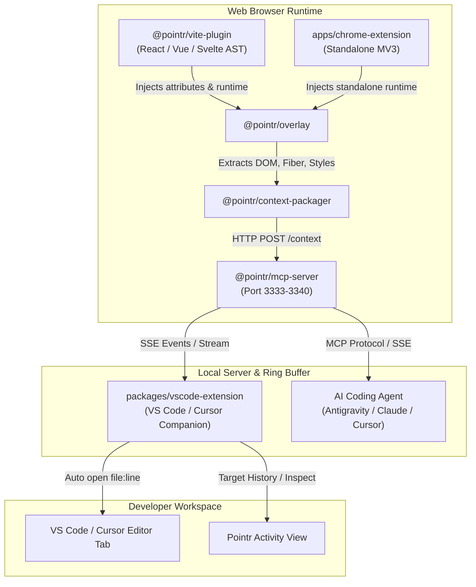
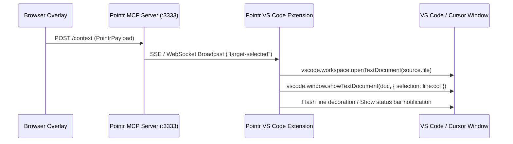
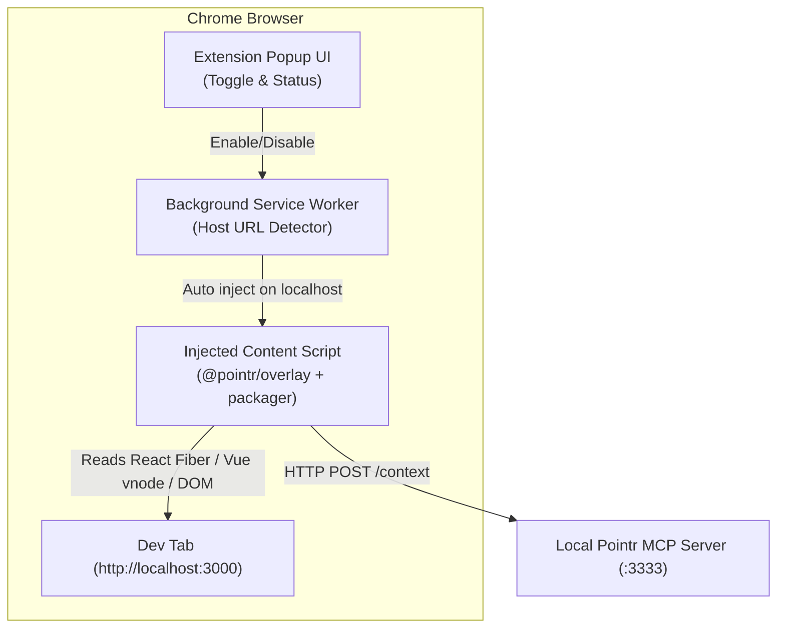
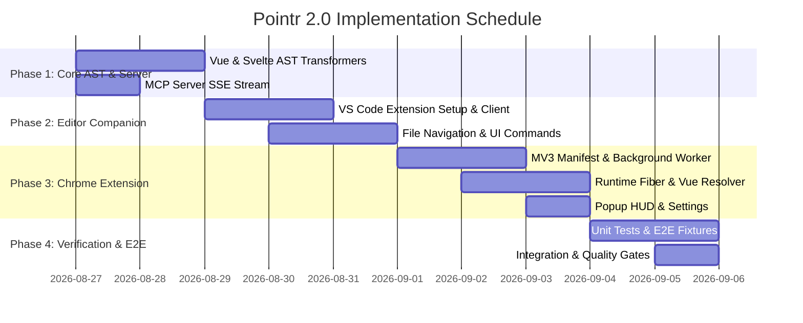

# Pointr 2.0 Expansion Technical Roadmap & Architecture Plan

This document outlines the architecture, specifications, and execution plan for the **Pointr 2.0 Expansion**, adding multi-framework support, a dedicated editor companion extension, and a standalone Chrome Extension to the Pointr ecosystem.

---

## 1. Architecture & Scope Overview

Pointr bridges the gap between browser runtime UI context and AI coding assistants. This expansion establishes three new architectural pillars while preserving Pointr's lightweight, zero-telemetry, local-first design.



### Monorepo Structure

```
pointr/
├── apps/
│   ├── demo/                    # React + Vite demo app
│   ├── landing/                 # Pointr product landing page
│   └── chrome-extension/        # [NEW] Standalone MV3 Chrome Extension
├── packages/
│   ├── context-packager/        # Framework metadata & DOM extraction
│   ├── init/                    # Zero-config CLI initializer
│   ├── mcp-server/              # Local MCP server & Ring Buffer
│   ├── overlay/                 # Visual element picker & HUD UI
│   ├── vite-plugin/             # AST transformation (JSX, TSX, Vue, Svelte)
│   └── vscode-extension/        # [NEW] VS Code & Cursor Companion Extension
├── docs/
│   ├── PLAN_EXPANSION.md        # [THIS DOCUMENT] Expansion roadmap
│   ├── architecture.md          # Core architecture specification
│   ├── api-reference.md         # MCP and HTTP API reference
│   └── getting-started.md       # Developer onboarding guide
└── turbo.json                   # Turborepo task pipeline
```

---

## 2. Pillar 1: Multi-Framework AST Plugins (`@pointr/vite-plugin`)

### 2.1 Objective

Expand `@pointr/vite-plugin` beyond JSX/TSX to natively tag template elements in **Vue 3 Single File Components (`.vue`)** and **Svelte Components (`.svelte`)** with `data-pointr-source="<relativeFilePath>:<line>:<col>"`.

```mermaid
flowchart LR
    File["Source File"] --> Router{"File Extension"}
    Router -->|.[jt]sx| Babel["Babel AST Parser<br/>(@babel/parser)"]
    Router -->|.vue| VueComp["Vue Compiler SFC<br/>(@vue/compiler-sfc)"]
    Router -->|.svelte| SvelteComp["Svelte Compiler<br/>(svelte/compiler)"]
    Babel --> TagJSX["Inject data-pointr-source"]
    VueComp --> TagVue["Inject template attributes"]
    SvelteComp --> TagSvelte["Inject element attributes"]
    TagJSX --> Output["Transformed Code + Source Map"]
    TagVue --> Output
    TagSvelte --> Output
```

### 2.2 Technical Specifications

#### A. Architecture Refactor (`packages/vite-plugin/src/`)

Refactor transformation logic into modular framework handlers:

```
packages/vite-plugin/src/
├── index.ts                     # Vite plugin entry point & middleware injector
├── transform.ts                 # Unified router dispatching to transformers
├── transformers/
│   ├── jsx.ts                   # Existing Babel AST parser for JSX/TSX
│   ├── vue.ts                   # Vue 3 template AST transformer
│   └── svelte.ts                # Svelte 4/5 AST transformer
├── next-plugin.ts               # Next.js webpack wrapper
└── webpack-loader.ts            # Webpack loader integration
```

#### B. Vue 3 SFC AST Transformer (`transformers/vue.ts`)

- **Dependency**: `@vue/compiler-sfc` (peer/direct dependency) and `magic-string`.
- **Parsing Strategy**:
  1. Use `parse(code, { filename: id })` to extract the `<template>` block descriptor.
  2. Compile/traverse the template AST nodes (`NodeTypes.ELEMENT`, `NodeTypes.COMPONENT`).
  3. For every element tag, calculate absolute source line and column by offsetting with `template.loc.start.line`.
  4. Use `MagicString` to insert ` data-pointr-source="${relativePath}:${line}:${column}"` immediately after the tag opening identifier.
  5. Preserve source maps and ignore `<template v-if>`, `<slot>`, or comment nodes.

```typescript
// Conceptual Implementation: transformers/vue.ts
import { parse, compileTemplate } from "@vue/compiler-sfc";
import MagicString from "magic-string";

export function transformVue(
  code: string,
  id: string
): { code: string; map: any } | null {
  const { descriptor, errors } = parse(code, { filename: id });
  if (errors.length > 0 || !descriptor.template) return null;

  const s = new MagicString(code);
  const relativePath = id.replace(process.cwd(), "").replace(/^\/+/, "");
  const templateStartOffset = descriptor.template.loc.start.offset;

  // Walk template AST to locate element start tags
  function walkNode(node: any) {
    if (node.type === 1 /* ElementTypes.ELEMENT */) {
      if (node.tag && node.loc) {
        const line = node.loc.start.line;
        const column = node.loc.start.column;
        const sourceAttr = ` data-pointr-source="${relativePath}:${line}:${column}"`;
        // Insert after tag name
        const insertPos = node.loc.start.offset + node.tag.length + 1;
        s.appendLeft(insertPos, sourceAttr);
      }
      if (node.children) {
        node.children.forEach(walkNode);
      }
    }
  }

  if (descriptor.template.ast) {
    walkNode(descriptor.template.ast);
  }

  return {
    code: s.toString(),
    map: s.generateMap({ hires: true, source: id }),
  };
}
```

#### C. Svelte AST Transformer (`transformers/svelte.ts`)

- **Dependency**: `svelte/compiler` and `magic-string`.
- **Parsing Strategy**:
  1. Use `svelte.parse(code, { filename: id })` to obtain the Svelte AST.
  2. Traverse the `html` root node (Svelte 4) / `fragment` (Svelte 5).
  3. Filter nodes of type `Element`, `InlineComponent`, `Slot`.
  4. Use `MagicString` to append `data-pointr-source="..."` into element start tags at `node.start + node.name.length + 1`.

#### D. Edge Cases & Resilience

- **Self-closing tags**: ``, `<input />`, `<br>` must not break attribute syntax.
- **Fragment root**: Components with multiple root elements (Vue 3 / React fragments).
- **Dynamic components**: `<component :is="...">`, `<svelte:component this={...}>`.
- **Dev-only guarantee**: Ensure transformation is strictly disabled when `config.command === 'build'` or `process.env.NODE_ENV === 'production'`.

### 2.3 Testing Matrix

- `packages/vite-plugin/tests/vue.test.ts`: Vue 3 SFC with nested templates, script setup, scoped CSS, and slots.
- `packages/vite-plugin/tests/svelte.test.ts`: Svelte components with reactive variables, slots, each blocks, and nested tags.
- `packages/vite-plugin/tests/jsx.test.ts`: Existing JSX/TSX regression suite.

---

## 3. Pillar 2: VS Code & Cursor Companion Extension (`packages/vscode-extension`)

### 3.1 Objective

Provide instant editor integration. When a developer clicks an element in the browser overlay, the companion extension immediately opens the source file and positions the cursor on the exact line and column in VS Code / Cursor.



### 3.2 Technical Specifications

#### A. Package Setup (`packages/vscode-extension`)

- **Type**: Standard VS Code Extension with TypeScript + `esbuild`/`tsup`.
- **Manifest (`package.json`)**:
  - `publisher`: `pointr-dev`
  - `name`: `pointr-vscode`
  - `displayName`: `Pointr Companion`
  - `activationEvents`: `onStartupFinished`

#### B. Core Modules

```
packages/vscode-extension/
├── src/
│   ├── extension.ts             # Activation, deactivation, command registrations
│   ├── connection/
│   │   ├── client.ts            # SSE / HTTP connection client to MCP Server (3333-3340)
│   │   └── port-scanner.ts      # Scans ports 3333-3340 for active Pointr instances
│   ├── navigation/
│   │   ├── opener.ts            # Resolves file paths & highlights line:column
│   │   └── uri-handler.ts       # Handles vscode://pointr-dev.pointr-vscode/open URIs
│   ├── views/
│   │   ├── status-bar.ts        # Status bar connection indicator & quick pick
│   │   └── history-view.ts      # Webview / TreeView of captured target payloads
│   └── commands/
│       ├── open-latest.ts       # Manual command: Pointr: Open Latest Target
│       ├── start-server.ts      # Manual command: Pointr: Start MCP Server
│       └── toggle-follow.ts     # Toggle Auto-Open Follow Mode (default: ON)
├── package.json
└── tsconfig.json
```

#### C. Real-Time Event Listener (`connection/client.ts`)

- Connects to `http://127.0.0.1:3333/mcp` or `http://127.0.0.1:3333/events` (new SSE broadcast endpoint in `@pointr/mcp-server`).
- Reconnects automatically on server reload with exponential backoff (1s -> 2s -> 5s).
- Fallback: Long-polling `/context/latest` if SSE is unavailable.

#### D. Navigation Handler (`navigation/opener.ts`)

- Converts relative file paths (`src/components/Header.tsx`) to absolute workspace paths using `vscode.workspace.workspaceFolders`.
- Handles cross-platform path separators (Windows `\` vs POSIX `/`).
- Positions the cursor and reveals line in the active text editor with a temporary highlight decoration:

```typescript
// Conceptual Implementation: navigation/opener.ts
import * as vscode from "vscode";
import * as path from "path";

export async function openSourceLocation(
  file: string,
  line: number,
  column: number
) {
  const workspaceFolders = vscode.workspace.workspaceFolders;
  if (!workspaceFolders || workspaceFolders.length === 0) return;

  const rootPath = workspaceFolders[0].uri.fsPath;
  const absolutePath = path.isAbsolute(file) ? file : path.join(rootPath, file);
  const fileUri = vscode.Uri.file(absolutePath);

  try {
    const document = await vscode.workspace.openTextDocument(fileUri);
    const zeroBasedLine = Math.max(0, line - 1);
    const zeroBasedCol = Math.max(0, column - 1);
    const position = new vscode.Position(zeroBasedLine, zeroBasedCol);

    const editor = await vscode.window.showTextDocument(document, {
      selection: new vscode.Range(position, position),
      preserveFocus: false,
      preview: false,
    });

    editor.revealRange(
      new vscode.Range(position, position),
      vscode.TextEditorRevealType.InCenter
    );

    // Apply temporary line highlight
    highlightLine(editor, position);
  } catch (err) {
    vscode.window.showWarningMessage(`Pointr: Could not open file ${file}`);
  }
}
```

#### E. Commands & Configuration

| Command ID                | Title                             | Description                                           |
| :------------------------ | :-------------------------------- | :---------------------------------------------------- |
| `pointr.openLatestTarget` | **Pointr: Open Latest Target**    | Opens the source code of the last element clicked     |
| `pointr.toggleFollowMode` | **Pointr: Toggle Auto-Open**      | Enable/disable auto-focusing files upon browser click |
| `pointr.copyContext`      | **Pointr: Copy Context Markdown** | Copies the latest element markdown to clipboard       |
| `pointr.startServer`      | **Pointr: Start Server**          | Spawns `@pointr/mcp-server` via integrated terminal   |

**Settings**:

- `pointr.autoOpenOnFileClick`: `boolean` (default: `true`)
- `pointr.serverPort`: `number` (default: `3333`)
- `pointr.highlightDurationMs`: `number` (default: `1500`)

---

## 4. Pillar 3: Standalone Chrome Extension (`apps/chrome-extension`)

### 4.1 Objective

Allow developers to use Pointr on **any** web project running on `localhost` / `127.0.0.1` **without modifying build configuration or installing Vite plugins**.



### 4.2 Technical Specifications

#### A. Architecture (`apps/chrome-extension/`)

- **Manifest**: Manifest V3 (`manifest.json`)
- **Tech Stack**: TypeScript, Vite, `@crxjs/vite-plugin` (or custom tsup build), Tailwind CSS (for popup).

```
apps/chrome-extension/
├── manifest.json                # MV3 manifest declaration
├── package.json
├── vite.config.ts               # Vite build config with CRX plugin
├── src/
│   ├── background/
│   │   └── service-worker.ts    # Tab monitoring & dev URL matching
│   ├── content/
│   │   ├── index.ts             # Content script coordinator
│   │   ├── runtime-injector.ts  # Injects overlay into DOM
│   │   └── fiber-resolver.ts    # Runtime Fiber/Vue component resolution
│   ├── popup/
│   │   ├── index.html
│   │   ├── App.tsx              # Popup React HUD UI
│   │   └── styles.css
│   └── options/
│       ├── index.html
│       └── App.tsx
```

#### B. Manifest V3 Declaration (`manifest.json`)

```json
{
  "manifest_version": 3,
  "name": "Pointr — Visual AI Context Selector",
  "version": "1.0.0",
  "description": "Inspect and pass frontend component context directly to AI coding agents and editors.",
  "permissions": ["activeTab", "scripting", "storage", "tabs"],
  "host_permissions": [
    "http://localhost/*",
    "http://127.0.0.1/*",
    "http://0.0.0.0/*",
    "http://*.localhost/*"
  ],
  "background": {
    "service_worker": "src/background/service-worker.ts",
    "type": "module"
  },
  "action": {
    "default_popup": "src/popup/index.html",
    "default_icon": {
      "16": "icons/icon-16.png",
      "48": "icons/icon-48.png",
      "128": "icons/icon-128.png"
    }
  }
}
```

#### C. Standalone Runtime Component Resolution (`content/fiber-resolver.ts`)

When `@pointr/vite-plugin` is not installed, elements will not have `data-pointr-source`. The standalone content script recovers component metadata at runtime:

1. **React Fiber Inspection**:
   - Access `__reactFiber$` / `__reactInternalInstance$` on the clicked DOM element.
   - Walk the Fiber tree upwards to extract:
     - `_debugSource` (`fileName`, `lineNumber`, `columnNumber`) if React runs in dev mode.
     - `_debugOwner` to determine the parent component hierarchy.
     - Component name (`fiber.type?.name` or `fiber.type?.displayName`).
2. **Vue 3 `__vnode` Inspection**:
   - Access `el.__vnode` and `el.__vueParentComponent`.
   - Extract component file location (`component.type.__file`) and props.
3. **Fallback DOM Path**:
   - If debug symbols are stripped, generate unique CSS path (`#root > div:nth-child(2) > button`), computed styles, text content, and high-resolution screenshot.

#### D. Content Script Injection (`background/service-worker.ts`)

- Automatically activates when navigating to any URL matching:
  - `http://localhost:*`
  - `http://127.0.0.1:*`
  - Custom local patterns configured in Extension Options.
- Injects overlay IIFE into the page and establishes communication with the local MCP server at `http://localhost:3333`.

---

## 5. Updates to `@pointr/mcp-server` & Shared Packages

To support the VS Code companion and Chrome Extension seamlessly:

### 5.1 Server-Sent Events (SSE) Broadcast

Add a dedicated SSE streaming endpoint in `packages/mcp-server/src/index.ts`:

- `GET /events`: SSE stream emitting events:
  - `{"event": "target-captured", "payload": PointrPayload}`
  - `{"event": "server-status", "status": "ok", "port": 3333}`
- Enables the VS Code extension to react instantly (< 15ms) without polling.

### 5.2 Universal Context Formatter Updates

Enhance `packages/context-packager/src/formatter.ts` to render framework-specific headers in Markdown:

- If Vue: Include `<template>` hierarchy and component props.
- If Svelte: Include Svelte component names and slot bindings.
- If React: Retain React Fiber component hierarchy.

---

## 6. Implementation Phases & Parallel Agent Task Breakdown



### Subagent Task Allocation

| Specialist Subagent       | Domain & Package                                       | Assigned Responsibilities                                                                                                                                                                                                                              |
| :------------------------ | :----------------------------------------------------- | :----------------------------------------------------------------------------------------------------------------------------------------------------------------------------------------------------------------------------------------------------- |
| **`frontend-specialist`** | `packages/vite-plugin`<br/>`packages/context-packager` | 1. Implement Vue 3 SFC transformer (`transformers/vue.ts`) with `@vue/compiler-sfc`.<br/>2. Implement Svelte transformer (`transformers/svelte.ts`) with `svelte/compiler`.<br/>3. Update context packager to format Vue and Svelte metadata.          |
| **`backend-specialist`**  | `packages/mcp-server`<br/>`packages/vscode-extension`  | 1. Add `/events` SSE broadcast endpoint to `mcp-server`.<br/>2. Build `packages/vscode-extension` core daemon and port scanner (3333-3340).<br/>3. Implement `vscode.workspace.openTextDocument` auto-navigation handler and status bar.               |
| **`chrome-extensions`**   | `apps/chrome-extension`                                | 1. Create Manifest V3 configuration and background service worker.<br/>2. Implement localhost / dev URL auto-detection.<br/>3. Build runtime React Fiber & Vue component resolver in content script.<br/>4. Develop popup toggle UI with Tailwind CSS. |
| **`test-engineer`**       | `tests` / `vitest`                                     | 1. Write Vitest unit tests for Vue/Svelte AST transformers.<br/>2. Create multi-framework test fixtures (`tests/fixtures/vue-app`, `tests/fixtures/svelte-app`).<br/>3. Verify VS Code URI handling and port collision fallbacks.                      |

---

## 7. Verification & Quality Gate Plan

### 7.1 Automated Quality Gates

1. **Typecheck & Monorepo Build**:
   ```bash
   pnpm run type-check
   pnpm run build
   ```
2. **Vitest Suite**:
   ```bash
   pnpm run test
   ```
   - Must achieve 100% pass rate across JSX, Vue SFC, and Svelte AST unit tests.
3. **Bundle Size Budget**:
   - `packages/overlay`: ≤ 15KB minified + gzipped.
   - `apps/chrome-extension` content script: ≤ 30KB minified.

### 7.2 Manual & End-to-End Verification Scenarios

| Scenario                        | Target Environment              | Expected Result                                                                                  |
| :------------------------------ | :------------------------------ | :----------------------------------------------------------------------------------------------- |
| **Vue 3 SFC Tagging**           | Vite + Vue 3 App (`.vue`)       | Holding Alt and hovering element displays exact `App.vue:14:5`; clicking sends payload to MCP.   |
| **Svelte Component Tagging**    | Vite + Svelte App (`.svelte`)   | Hovering `<button>` displays `Button.svelte:8:3`; clicking captures context.                     |
| **VS Code Auto-Focus**          | VS Code / Cursor + Browser      | Clicking any element in browser immediately opens and centers the target file:line in editor.    |
| **Chrome Extension Standalone** | React App (without Vite plugin) | Extension activates on `localhost:3000`, extracts Fiber `_debugSource`, and sends to MCP server. |
| **Port Collision Resilience**   | 2 concurrent dev projects       | First server binds `3333`, second binds `3334`; extensions and overlay connect seamlessly.       |

---

## 8. Summary of Deliverables

1. **`packages/vite-plugin`**: Added support for `.vue` and `.svelte` templates.
2. **`packages/vscode-extension`**: Companion extension for VS Code / Cursor with auto-focus and MCP listener.
3. **`apps/chrome-extension`**: Standalone Manifest V3 extension for zero-config element picking on local servers.
4. **`packages/mcp-server`**: Added `/events` real-time SSE stream for companion tools.
5. **Documentation & Tests**: Multi-framework test fixtures, updated architectural documentation, and full verification suite.
