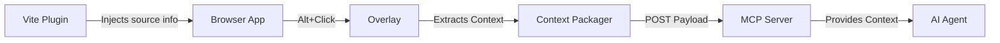

# Pointr Documentation

Welcome to the Pointr documentation. Pointr is a suite of tools connecting your browser context with AI coding agents (like Claude Code, Cursor, Windsurf) through a Vite plugin, a browser overlay, and an MCP server.

## Quick Links

- [GitHub Repository](https://github.com/KananBasha/pointr)
- [CONTRIBUTING](https://github.com/KananBasha/pointr/blob/main/CONTRIBUTING.md)
- [SECURITY](https://github.com/KananBasha/pointr/blob/main/SECURITY.md)

## Documentation Index

- [Getting Started](getting-started.md) — Installation, initial setup, and troubleshooting
- [API Reference](api-reference.md) — Complete technical reference for all Pointr packages
- [Architecture](architecture.md) — Technical overview, system diagrams, and design decisions

## High-Level Data Flow

