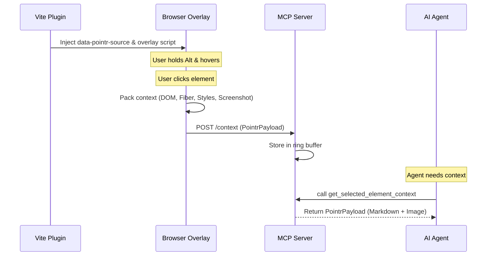

# Technical Architecture

Pointr bridges the gap between browser runtime context and AI coding assistants using four specialized packages.

## System Sequence



## Package Dependencies

```mermaid
flowchart TD
    VP[@pointr/vite-plugin] --> OV[@pointr/overlay]
    OV[@pointr/overlay] --> CP[@pointr/context-packager]
    OV -->|HTTP POST| MCP[@pointr/mcp-server]
    MCP -->|MCP Protocol| AI[AI Agent]
```

## Core Design Decisions

### Dev-Only Injection
The `@pointr/vite-plugin` is strictly `apply: 'serve'`.
> [!IMPORTANT]
> Injecting `data-pointr-source` attributes increases DOM size and leaks file paths. It must never leak into production builds. 

### React Fiber Traversal
To build the `componentTree`, `@pointr/context-packager` traverses the React Fiber tree attached to the selected DOM element.
- **Max Depth:** Capped at 10 levels to prevent infinite loops and excessive payload sizes.
- **Props Serialization:** Props are deeply cloned with cyclic references and functions safely stripped or stringified to prevent serialization errors.

### Design Token Extraction
The packager traverses `document.styleSheets` to map computed styles back to CSS variables (design tokens).
- **Cross-Origin:** Gracefully catches and ignores `SecurityError` when accessing stylesheets from external domains (e.g., Google Fonts).

### Ring Buffer State
The `@pointr/mcp-server` stores payloads in a memory-backed Ring Buffer.
- **Capacity:** Maximum 10 payloads.
- **Strategy:** Last-In, First-Out (LIFO). The agent typically only cares about the *latest* clicked element.

### Port Auto-Discovery
To ensure smooth DX, the MCP server automatically handles port collisions by walking from `3333` to `3340` upon `EADDRINUSE`. The overlay script attempts to POST to the same range sequentially if it encounters connection refusals.

### Bundle Budget
The `@pointr/overlay` is bundled as an IIFE (Immediately Invoked Function Expression) with a strict budget of **≤15KB** (minified + gzipped).
- **Why:** The overlay is injected into every development page load. Keeping it ultra-lightweight ensures it doesn't degrade the developer's perception of their own application's performance.

## Technical Comparison with Stagewise

While Stagewise focuses on full-session recording and visual bug reporting across environments, Pointr is strictly a local development tool tailored for immediate AI interaction.

- **Storage:** Stagewise stores state remotely; Pointr stores state entirely in a local RAM ring buffer (MCP server).
- **Protocol:** Pointr natively exposes the Model Context Protocol (MCP); Stagewise relies on proprietary APIs.
- **Scope:** Pointr extracts precise structural component data (Fiber tree, source coordinates) rather than capturing replayable interaction sessions.
